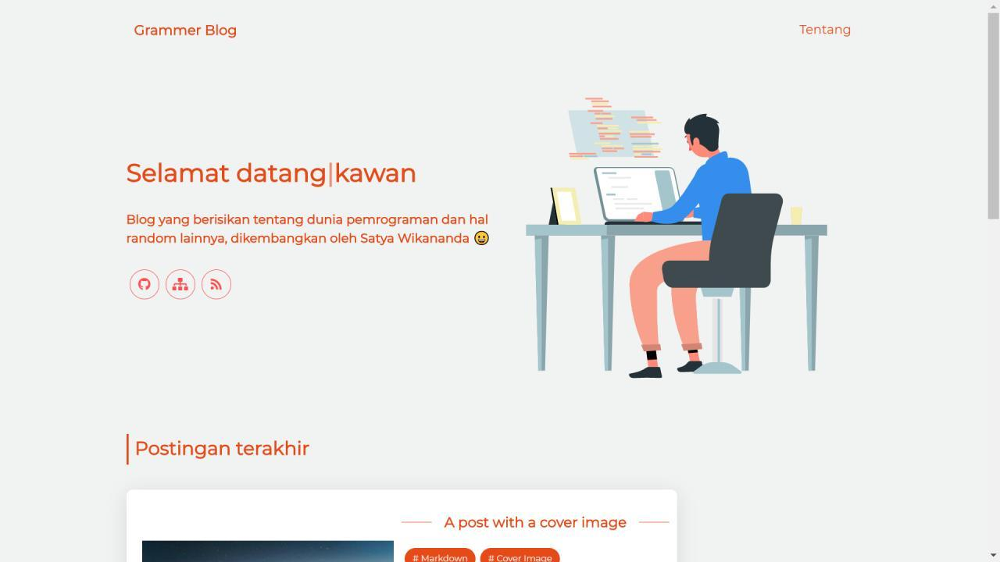

<div align="center">
    <h1> Grammer blog ✍😎</h1>
    
[](https://raw.githubusercontent.com/satyawikananda/grammer-blog/master/LICENSE?token=AH44ZFA2LFCUSQ2P2DOYYKS7L6QWQ)
[](https://img.shields.io/github/issues/satyawikananda/grammer-blog)
[](https://img.shields.io/github/forks/satyawikananda/grammer-blog)
[](https://img.shields.io/github/stars/satyawikananda/grammer-blog)
</div>

# Deskripsi
> Blog yang berisikan tentang teknologi web atau pemrograman dan hal random lainnya, yang dibuat menggunakan Gridsome

# Screenshot 👀



# Fitur blog

* Halaman <i>Landing page</i>
* Halaman spesifik <i>tag</i>
* Halaman Blog konten
* <i>Comment system</i> Disqus di setiap halaman blog konten
* Halaman 404
* Mendukung <i>Progressive Web App</i>
* Mendukung tampilan <i>mobile</i>
* Fitur bagikan ke beberapa sosial media seperti Twitter, Facebook, Telegram, Line, dan Whatsapp

# Cara pemasangan
```
npm install

atau

yarn install
```

# Cara menjalankan
```
npm run develop

atau

yarn develop
```

# Cara build
```
npm run build

atau

yarn build
```

# Teknologi dan pendukung yang digunakan

* [Vue.JS 2](https://vuejs.org) Sebagai <i>Framework</i> javascript
* [Gridsome](https://gridsome.org) Sebagai <i>Jamstack framework</i> untuk Vue.js
* [Vuesax 3](https://lusaxweb.github.io/vuesax/) Sebagai <i>UI Component</i> untuk Vue.JS
* [Vercel](https://vercel.com) Sebagai tempat <i>deploy</i> untuk situs blog ini

# Pengembang
[Satyawikananda](https://instagram.com/satyawikananda) ©2020
