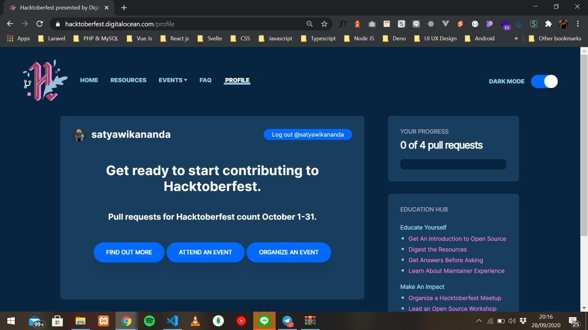
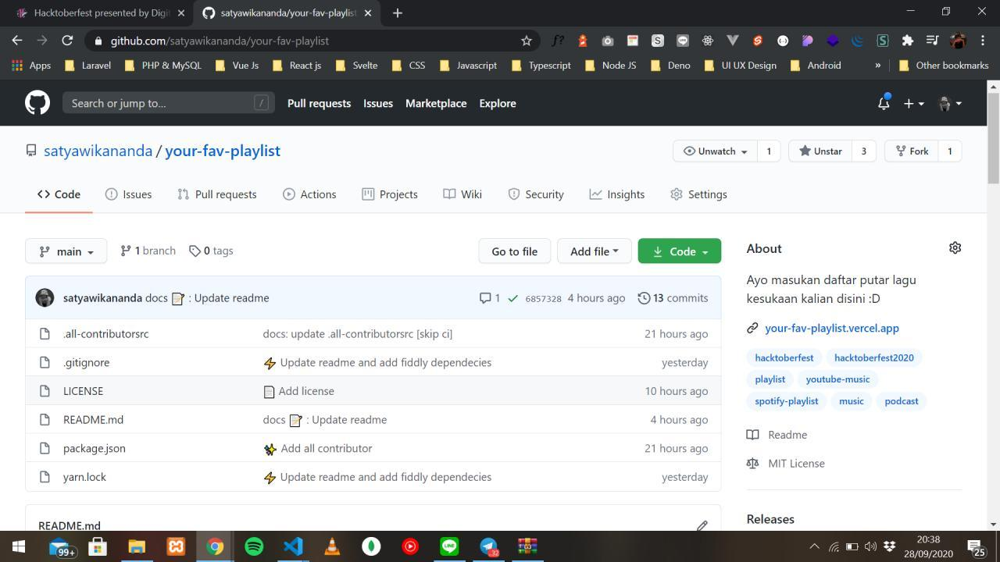

Hallo teman-teman semua, apa kabar? semoga semua sehat dan baik yaa, dan tetap semangat dalam menjalani aktivitas setiap hari walau kita semua masih dilanda pandemi *covid-19*. Oke, kali ini saya mau ngasi tau bahwa di bulan oktober nanti bakal ada sebuah event *global* yang dimana kalian semua bisa mengikutinya secara gratis, sudah gratis dan bakal dapat *swag* yang ga kalah keren lagi, enak bukan? ya enak lah hahaha. Nama event itu adalah **Hacktoberfest**, apa itu Hacktoberfest?🤔. Yuk simak dibawah ini :D.

# Penjelasan Hacktoberfest 😀

**Hacktoberfest** adalah event tahunan yang diselenggarakan oleh **DigitalOcean** setiap tahunnya pada bulan ke 10 yaitu bulan oktober selama 1 bulan penuh setiap tahunnya. Event ini mengajak semua developer untuk berkonstribusi di dunia *open source* dengan cara mengirimkan *pull request* ke *repository* manapun di platform **Github** dan bahkan, kita juga bisa mengirimkan *pull request* ke *repository* kita sendiri, mungkin untuk kedepannya saya bakal menjelaskan bagaimana cara membuat pull request di suatu repository manapun di github di konten selanjutnya.

# Bagaimana caranya ikut berpartisipasi ? 🤔
Seperti yang sudah saya jelaskan sebelumnya, untuk ikut berpartisipasi teman-teman harus mengirimkan *pull request* ke repo manapun di Github, jadi dipastikan teman-teman harus memiliki akun Github terlebih dahulu, jika teman-teman belum memiliki akun Github, bisa buka [Github.com](https://github.com) lalu isi formulir yang terdapat disana untuk melsayakan pendaftaran akun Github.

Nah jika teman-teman sudah memiliki akun Github, teman-teman bisa melsayakan login di situs resmi [Hacktoberfest nya](https://hacktoberfest.digitalocean.com/). Nah sepengelaman ku ikut hacktoberfest tahun lalu, setelah login teman-teman akan diarahkan ke menu dashboard yang berisi poin dimana poin ini adalah jumlah PR kalian di projek open source (repository) di Github dan daftar-daftar repository yang sudah kalian PR dan di app, untuk tahun lalu sih hanya minimal 4 kali PR ke repo open source manapun di github, dan jika lebih juga tidak apa-apa. Dibawah ini merupakan dashboard hacktoberfest tahun lalu yang dimana sudah selesai melsayakan PR sebanyak minimal 4 kali.

Sumber gambar: <a href="https://media.geeksforgeeks.org/wp-content/uploads/20200122000124/hacto.jpeg">Geeksforgeeks</a>

> **Fyi**: Sepengalaman ku waktu saya ikut hacktoberfest tahun kemarin, kita juga bisa pull request ke repository kita sendiri di github dan poinnya itu nambah, jadi walau teman-teman PR ke repo sendiri, poinnya itu akan tetap bertambah.

# Swag dari hacktoberfest 😎
Mungkin ini juga yang ditunggu-tunggu dari partisipan hacktoberfest, apalagi kalau bukan **Swag** 😂. Untuk swag ini kalian bisa dapatkan jika sudah memenuhi syarat dari event ini yaitu melsayakan PR sebanyak minimal 4 kali, swag ini biasanya berupa baju official dari **Hacktoberfest** dan juga dari **DigitalOcean**, dan kalau tahun kemarin itu, selain dapat kaos, saya juga dapat stiker resmi dari [dev.to](https://dev.to) untuk jumlah stikernya itu lumayan banyak, sepertinya sekitar 3-5 stiker dan stikernya tentunya bukan hanya dari dev.to saja melainkan ada juga dari hacktoberfestnya sendiri. Desain kaos hacktoberfest, biasanya berbeda-beda tiap tahun, berikut merupakan desain kaos hacktoberfest pada tahun 2018 dan 2019

> 
Ini adalah desain baju pada tahun 2018. Sumber gambar: <a href="https://miro.medium.com/max/2676/1*orFDyb7o_lTGuNefYvr4xg.png">Code like a girl</a>

> 
Ini adalah desain baju pada tahun 2019. Sumber gambar: <a href="https://pbs.twimg.com/media/ETiblH4XYAAOlV1.jpg">Twitter Hacktoberfest</a>

# Tambahan 📝

Untuk kalian yang masih bingung mau berkontribusi di repositori orang, jangan khawatir, saya sudah membuat sebuah repositori yang dimana kalian bisa meletakkan playlist lagu atau podcast yang kalian suka di repositori saya, untuk pranala repositorinya, bisa diklik [disini](https://github.com/satyawikananda/your-fav-playlist)

Oke, mungkin untuk konten kali ini saya cukupkan, semoga kalian makin semangat untuk mengikuti event ini dan semoga kalian paham dengan apa yang sudah saya jelaskan sebelumnya dan jika kalian ingin memantau terus info dari event ini kalian bisa kunjungi situs resminya di [https://hacktoberfest.digitalocean.com/](https://hacktoberfest.digitalocean.com/) lalu kalian bisa submit email kalian agar bisa mendapatkan info melalui email kalian dari hacktoberfestnya lalu jika ada yang kurang jelas mengenai event ini, bisa kalian lihat dihalaman [faq hacktoberfest](https://hacktoberfest.digitalocean.com/faq). Jika ada kesalahan kata atau ada yang kurang dimengerti, saya mohon maaf, karena ini merupakan konten blog pertama saya, so see you next time 👋

> **NB**: Postingan ini diperbaharui pada tanggal 28 September 2020
