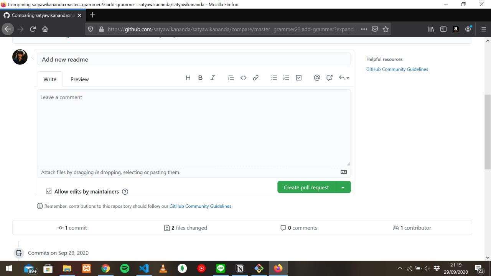

Dipostingan sebelumnya tentang apa itu Hacktober ([klik disini](https://grammer-blog.vercel.app/posts/hacktoberfest-2020/)), saya sudah janji kalau saya akan menjelaskan bagaimana cara membuat Pull request di github. Saya membuat konten ini untuk membantu teman-teman berpartisipasi dalam dunia open source khususnya projek-projek yang open source di Github, dan ini juga menjadi syarat untuk menyelesaikan event Hacktoberfest di bulan oktober ini, tanpa basa basi lagi, simak pembahasannya dibawah ini.

# Apa itu Pull Request? 🤔
Pull request adalah sebuah metode di git yang bertujuan untuk melakukan permintaan penggabungan kode yang dimana sebelumnya ada dua jenis *commit* yang berbeda di beda *branch* menjadi satu setelah disetujui oleh si pemilik repository. Untuk melakukan PR di Github, dipastikan kamu harus memiliki akun github terlebih dahulu. Jika sudah mari ke penjelasan selanjutnya

# Langkah-langkah membuat Pull Request 🏃‍♂️🏃‍♀️
Oke tanpa basa basi lagi, langsung saja ke langkah-langkahnya

> Untuk akun github ini, saya menggunakan akun github kedua saya 

1. **Fork repositori yang kalian ingin pull request**

Pertama, kalian harus klik tombol fork di repositori yang kalian ingin pull request. Untuk kasus ini, saya sudah memilih repositori dari akun pertama saya [ini](https://github.com/satyawikananda/satyawikananda)


Setelah itu, tunggu beberapa saat sampai selesai.


2. **Klon repositori**

Langkah kedua, jika proses forking repositorinya sudah selesai, klon repositori tersebut dengan langkah yang pertama, klik tombol **code**, lalu salin pranala yang ada dibagian https tersebut.


Setelah pranala tersebut sudah disalin, buka terminal atau command prompt favorit kalian (dalam tutorial ini, saya menggunakan git bash) di folder manapun, bebas kalian sendiri yang menentukan, setelah itu jalankan perintah git klon dibawah ini

```
git clone [pranala https yang sudah disalin sebelumnya]
```
> pada saat menjalankan perintah itu, kurung kotak tersebut tidak diisi


Jika sudah selesai klon repositori tersebut, buka direktori projek repositori tersebut yang sudah di clone sebelumnya.

3. **Membuat branch baru**

Jika sudah berada didirektori projek tersebut, selanjutnya mari bikin branch baru dengan cara menjalankan perintah ini di command line atau terminal kalian:

```
git branch <nama_branch>
```


Setelah membuat branch baru, kalian jalankan perintah untuk pindah ke branch itu dengan cara menjalankan perintah dibawah ini: 

```
git checkout <nama_branch>
```
hasil: 
```
Switched to branch 'nama_branch'
```


4. **Tambah fitur baru, commit dan push**

Sekarang kalian sudah ada dibranch yang sudah kita buat sebelumnya, selanjutnya adalah, kalian buatlah suatu perubahan entah itu merubah isi file yang sudah diklon sebelumnya atau menambahkan sesuatu yang baru seperti file readme dengan tipe markdown yang baru. Untuk kasus yang saya lakukan ini, saya menambahkan file baru dengan ekstensi markdown (.md) yang bernama **grammer.md**, untuk menambahkan file baru di terminal atau command prompt bisa menggunakan perintah **```touch <nama_file>```**, setelah itu file baru akan muncul didirektori tersebut.

Selanjutnya adalah isilah sesuatu di file readme yang sudah kalian buat sebelumnya, untuk mengisinya kalian bisa menggunakan kode editor kesayangan anda, untuk kasus saya ini, saya menggunakan **vim** agar lebih cepat saja karena masih dalam basis terminal. File readme tersebut saya akan mengisi sesuatu seperti kata 'hello world', berikut gambarnya:


Jika sudah, kalian kembali lagi ke terminal dan jalankan perintah git ini, **```git add .```**, perintah itu berfungsi untuk membawa semua file yang sudah kalian perbaharui ke mode *stage*, setelah itu, kalian bisa komit file yang berada di stage tersebut dengan menjalankan perintah git **```git commit -m "Add new readme"```**, untuk pesannya bebas kalian mau beri seperti apa.


Setelah komit file tersebut, kalian bisa *push* perubahan file tersebut dengan menjalankan perintah git dibawah ini: 
```
git push origin <nama_branch saat ini>
```

5. **Saatnya Pull Request**

Setelah push ke repositori hasil forking tersebut ke github, kalian coba klik tombol ganti branch lalu disana bakal ada branch baru yang sudah kalian buat sebelumnya


Lalu untuk melakukan pull request, kalian bisa klik yang bertulisan **Pull Request**, lalu kalian akan diarahkan ke halaman tempat kalian akan melakukan pull request, disana kalian bisa memberikan judul pull request kalian dan kolom komentar dengan markdown, jika ingin membuat pull request, kalian bisa klik tombol **Create pull request** yang ada dibawah ini



Setelah itu selamat !, kalian sudah berhasil membuat pull request kalian direpositori tersebut 😊


Baiklah sekian dari penjelasan saya mengenai cara melakukan pull request diprojek open source github, semoga apa yang saya jelaskan diatas bisa kalian pahami, dan saya harap tulisan saya ini bermanfaat untuk kalian para pembaca konten saya ini, dan jika ada yang bingung, silahkan kirim komentar dikolom komentar disqus dibawah ini, so see you next time 👋
