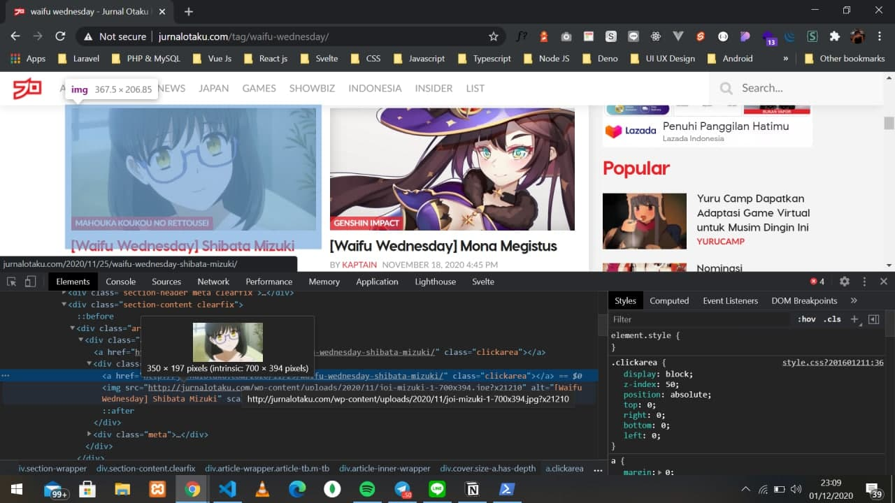
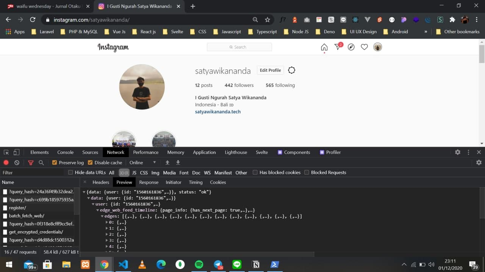
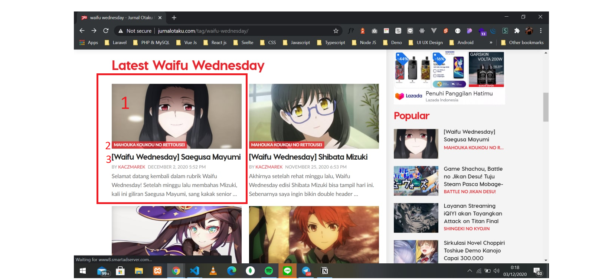
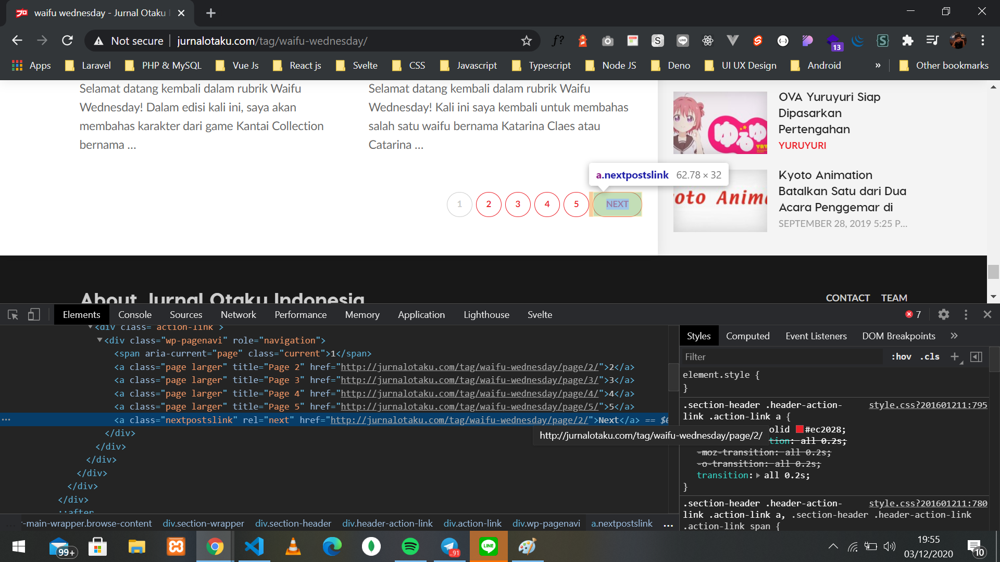

Halo semuanya, sudah lama saya tidak merilis artikel diblog saya ini dikarenakan baru sempat dan niat yang cukup untuk menulis hahaha. Pada tulisan saat ini, saya ingin membagikan pengalaman saya mengenai web scraping. Pada kasus kali ini, saya akan menscraping sebuah laman di website jurnal otaku tag waifu wednesday, dan untuk kali ini saya ingin mengambil daftar-daftar waifu yang ada dilaman tersebut.

# Pendahuluan 😀
Web scraping merupakan kegiatan yang dilakukan untuk mengambil data tertentu secara semi-terstruktur dari sebuah halaman website (sumber: wikipedia), singkatnya web scraping adalah sebuah teknik untuk mengambil nilai dari sebuah elemen tertentu dari suatu website. Untuk web scraping ini sepengetahuan saya ada beberapa teknik seperti mengambil nilai dari DOM HTML yang bisa kita lihat melalui inspect element pada dev tools browser kalian atau bisa dengan cara melihat request dan response dari API yang digunakan yang dimana kita bisa lihat tersebut di menu network browser kalian.


> <p align="center">Screenshot DOM HTML inspect element </p>


> <p align="center">Screenshot network tab dev tools </p>

# Perkakas yang digunakan 🔧
Pada kasus saya ini, saya menggunakan bahasa pemrograman Javascript dan lebih tepatnya menggunakan Node.js, kenapa saya menggunakan Node.js sedangkan ada bahasa python dll ? karena saya bisanya hanya Node.js saja :'). Lalu selain itu saya juga menggunakan beberapa pustaka sumber terbuka seperti:

1. Axios

Axios ini merupakan sebuah pustaka berbasis `promise` yang dimana kita bisa mengambil semua isi DOM HTML dari website tujuan kita.

Sumber kode: [https://github.com/axios/axios](https://github.com/axios/axios)

2. Cheerio

Jika kalian sudah familiar dengan salah satu pustaka terkenal yang bernama jQuery, saya yakin kamu akan dengan mudah menggunakan pustaka yang satu ini karena syntax atau gaya penulisan untuk menggunakan pustaka ini mirip dengan pada saat kamu menggunakan jQuery. Cheerio merupakan sebuah pustaka yang berguna untuk memparsing DOM HTML yang sudah kita dapatkan sebelumnya dengan menggunakan Axios.

Sumber kode: [https://github.com/cheeriojs/cheerio](https://github.com/cheeriojs/cheerio)

3. Chalk

Chalk merupakan sebuah pustaka yang dimana kamu bisa melakukan styling seperti memberi warna font pada tulisan serta memberikan warna pada background di terminal kamu masing masing. Pada kasus saya ini, saya menggunakan chalk untuk memberikan styling tulisan diterminal saya pada saat memulai dan selesai melakukan proses scraping data.

Sumber kode: [https://github.com/chalk/chalk](https://github.com/chalk/chalk)

# Memulai scraping 🏃‍♀️🏃‍♂️
## Installasi perkakas dan pustaka-pustaka
Sebelum memulai scraping, pastikan kamu sudah menginstall Node.js di PC atau laptop kalian masing-masing, untuk penginstallannya kalian bisa mengunjungi link ini [https://nodejs.org/en/](https://nodejs.org/en/). 

Untuk package manager kali ini saya menggunakan package manager yang bernama pnpm, saya memakai pnpm ini dikarenakan saya rasa ini lebih cepat dari yarn ataupun npm, jika kamu ada pendapat boleh di tulis di kolom komentar dibawah ini, tapi kalau kamu menggunakan package manager yang lain, kamu bisa menyesuaikannya sendiri lagi. Tetapi sebelum melakukan penginstallan pustaka-pustaka, pastikan dulu kamu sudah menginisialisasikan projek tersebut dengan package manager kamu masing-masing, untuk caranya kamu bisa sesuaikan dengan package manager kamu, setelah sudah diinisialisasikan kamu bisa menginstall pustakanya dengan menjalankan perintah dibawah ini:

```
pnpm install axios cheerio chalk
```

Jika sudah menginstall pustaka-pustaka tersebut, untuk struktur foldernya sendiri, kamu bisa mengunjungi repositori projek saya di github [satyawikananda/waifugenerator](https://github.com/satyawikananda/waifu-generator).

## Saatnya mengambil data waifu
Untuk scraping kali ini, saya menggunakan cara mengambil nilai-nilai dari DOM HTML yang sudah saya jelaskan sebelumnya, kenapa saya memakai cara ini ? karena website yang saya akan `scrape` ini tidak ada melakukan proses request dan response dari sebuah rest API, oleh karena itu saya mengambil nilai nilai dari DOM HTML di website tersebut.

Jika kamu sudah melihat repositori projek saya di github, kalian bisa melihatnya di dalam folder `src` dan disana akan terdapat berkas javascript yang bernama waifuScrape.js yang dimana didalam berkas tersebut berisikan proses dan cara scraping data yang saya lakukan.

Langkah pertama yang saya lakukan adalah saya memanggil pustaka seperti axios, cheerio, dan chalk. Untuk memanggil pustaka-pustaka tersebut bisa dilakukan dengan cara dibawah ini:

```js
const axios = require('axios').default
const cheerio = require('cheerio')
const chalk = require('chalk')
```

Lalu langkah yang kedua, saya membuat sebuah arrow function yang bernama `WaifuGenerator` yang dimana function tersebut berisi proses scraping data-datanya, dan juga terdapat sebuah parameter yang bernama url yang dimana nanti akan menerima sebuah argumen base url berisi url http://jurnalotaku.com/tag/waifu-wednesday/, untuk kodenya bisa dilihat dibawah ini: 

```js
const data = []
const WaifuGenerator = (url) => {
    return new Promise( async (resolve, reject) => {
        await axios.get(url)
         .then( async (response) => {
            if(response.status == 200){
                const html = response.data
                const $ = cheerio.load(html)
                const articleWaifu = $(".article-wrapper.article-tb.m-tb")
                articleWaifu.each((i, el) => {
                    const image = $(el).find(".article-inner-wrapper > .cover.size-a.has-depth > img").attr("src")
                    const anime = $(el).find(".article-inner-wrapper > .meta > a:nth-child(1)").text().trim()
                    const name = $(el).find(".article-inner-wrapper > .meta > a:nth-child(2).title > h3 > span").text().replace("[Waifu Wednesday]", "").trim()
                    data.push({
                        image,
                        anime,
                        name
                    })
                })
                const nextUrlPage = $(".nextpostslink").attr("href")
                if(nextUrlPage === undefined)  return false;
                console.log(chalk.yellow.bgBlue(`Scraping next url: ${nextUrlPage}`))
                return await WaifuGenerator(nextUrlPage)
            }
         })
         .catch((err) => {
            reject(err)
         })
        resolve(data)
    })
}
```
Tenang, jika kamu masih kurang paham dengan alur kode diatas, saya akan menjelaskannya hahaha. Pertama, saya membuat variabel bernama data yang berisi array kosongan yang nantinya berguna untuk menyimpan data scraping tersebut ke dalam array kosongan itu. 

Lalu yang kedua, didalam `arrow function` tersebut, saya akan langsung mengembalikan sebuah `promise` yang nantinya akan menjalankan fungsi `resolve` dan `reject` serta saya juga menambahkan metode `async` dan `await` dikarenakan saya ingin menjalankan sebuah proses `asynchronous`.

```js
await axios.get(url)
    .then( async (response) => {
        if(response.status == 200){
            const html = response.data
            const $ = cheerio.load(html)
            ...
        }
    })
```

Lalu yang ketiga, seperti kode yang saya tunjukan diatas ini, saya memanggil url dari parameter yang nantinya akan berisi base url dari http://jurnalotaku.com/tag/waifu-wednesday/ oleh axios ini setelah itu saya `then` untuk mengambil response dari url tersebut setelah itu hasil dari response tersebut, saya simpan didalam variabel yang bernama `html` yang dimana variabel `html` itu akan disimpan didalam variabel bernama `$` dan juga didalam nilai variable `$` memanggil pustaka load dari cheerio yang dimana fungsi load dari cheerio tersebut menerima sebuah argumen dari isi variabel `html` tersebut

> Saya menamakan variabel tersebut dengan nama `$` dikarenakan agar terlihat mirip nanti seperti jQuery mengingat cheerio ini memiliki `syntax` yang mirip dengan jQuery

Selanjutnya saya ingin mendapatkan nilai dari elemen DOM dan akan saya jadikan data yang akan disimpan didalam variabel `data` yang berisi array kosongan tersebut.



Diatas ini terdapat nomor-nomor, untuk yang saya tandai akan saya jelaskan beserta juga dengan kodenya dibawah ini.

```js
/*
    Untuk yang saya beri kotak itu, itu merupakan sebuah kelas yang bernama
    article-wrapper yang dimana, kelas tersebut bertujuan untuk membungkus
    elemen-elemen seperti gambar, judul dan deskripsi. Kelas tersebut
    saya jadikan sebuah variabel bernama articleWaifu.
*/
const articleWaifu = $(".article-wrapper.article-tb.m-tb")
/*
    Variabel articleWaifu ini, saya looping dikarenakan elemen tersebut
    tidak hanya berisi satu saja, melainkan lebih dari satu maka dari
    itu saya looping dengan menggunakan fungsi each dari cheerio
*/
articleWaifu.each((i, el) => {
    /* 
        Untuk nomor 1, itu merupakan sebuah gambar yang dimana saya ingin mengambil
        attribute src-nya, yang dimana nilai dari attribute itu berisi link url
        gambar tersebut
    */
    const image = $(el).find(".article-inner-wrapper > .cover.size-a.has-depth > img").attr("src")
    /*
        Untuk nomor 2, itu merupakan judul dari anime karakter tersebut, untuk
        mendapatkan nilainya, bisa dilakukan dengan cara dibawah ini
    */
    const anime = $(el).find(".article-inner-wrapper > .meta > a:nth-child(1)").text().trim()
    /*
        Untuk nomor 3, itu merupakan nama dari waifu tersebut, untuk mendapatkan
        nilainya, bisa dilakukan dengan cara dibawah ini
    */
    const name = $(el).find(".article-inner-wrapper > .meta > a:nth-child(2).title > h3 > span").text().replace("[Waifu Wednesday]", "").trim()
    /*
        Setelah semua nilai sudah disimpan didalam variabel, kamu bisa memanggil
        variabel data lalu gunakan push untuk memasukan nilai-nilai tersebut ke
        array tersebut, oh ya, jangan lupa dijadikan objek juga agar menjadi
        data array of object nantinya
    */
    data.push({
        image,
        anime,
        name
    })
})
```

Dikarenakan website tersebut memiliki pagination, saya ingin datanya itu terambil juga dihalaman yang lainnya sampai kehalaman paling ujung dari website tersebut, untuk mengakali itu, saya mengambil nilai atribut href dari tombol `next pagination` yang dimana itu berisi nilai url ke halaman selanjutnya



Setelah mendapatkan itu, saya gunakan teknik rekursif dimana teknik ini merupakan sebuah teknik dimana fungsi tersebut akan memanggil fungsinya itu sendiri, untuk kodenya bisa dilihat dibawah ini

```js
// Mengambil nilai dari attr href 
const nextUrlPage = $(".nextpostslink").attr("href")
// Jika nextUrlPage tidak memiliki attr href lagi, maka akan return false
if(nextUrlPage === undefined) return false;
console.log(chalk.yellow.bgBlue(`Scraping next url: ${nextUrlPage}`))
// Melakukan rekursif dengan menerima argumen dari variabel nextUrlPage
return await WaifuGenerator(nextUrlPage)
```

## Export data ke json 📝
Sebelumnya kita sudah membuat kode untuk melakukan scraping data, nah langkah selanjutnya adalah kita akan membuat data-data tersebut tersimpan disebuah file `.json`, untuk melakukannya, saya membuat berkas bernama `index.js` di root projek yang kita kerjakan, dan didalam file tersebut, kita akan mengenerate data-data tersebut ke dalam bentuk file `.json`, untuk kodenya bisa dilihat dibawah ini

```js
const waifuScrape = require('./src/waifuScrape')
const fs = require('fs')
const path = require('path')
const chalk = require('chalk')
const outputFile = path.join(__dirname, 'data/', 'data.json')
const baseUrl = "http://jurnalotaku.com/tag/waifu-wednesday/page/1"

// Mulai proses disini
async function scrape() {
    // Memanggil fungsi scraping dan menerima argumen dari var base url
    const response = await waifuScrape(baseUrl)
    const data = await response
    // Proses membuat data-datanya menjadi file .json
    fs.writeFile(outputFile, JSON.stringify(data), err => {
        if(err) console.log(err)
        console.log(chalk.blue.bgYellow(`\n =========Scraping data successfully finished========= \n`))
    })
}

console.log(chalk.blue.bgYellow(`\n =========Scraping Start========= \n`))
scrape()
```

Bisa dilihat diatas, pertama kita akan memanggil sebuah modul bawaan Node.js yang bernama fs yang dimana modul itu kita akan gunakan untuk membuat sebuah berkas `.json` nya, setelah itu saya membuat sebuah fungsi yang dimana akan menjalankan proses pembuatan berkas tersebut, setelah dijalankan maka proses scraping data dimulai dan jika sudah selesai maka berkas tersebut akan berada di dalam folder `data/data.json` seperti isi dari nilai variabel `outputFile`, berikut merupakan hasil dari data tersebut. [Klik disini](https://raw.githubusercontent.com/satyawikananda/waifu-generator/main/data/data.json)

# Jadikan API dengan Vercel 🌐
Vercel adalah sebuah platform dimana kamu bisa mendeploy website statis kamu secara gratis dan sudah bisa diakses langsung dengan domain `.vercel.app`. Selain website, kita juga bisa mengandalkan fitur serverless function dimana dengan mengandalkan fitur ini, kita bisa deploy api kita di vercel

> Selain Javascript/Typescript (Node js), Vercel juga mendukung bahasa yang lain seperti Go, Python, Ruby, dll. Selengkapnya bisa liat [disini](https://vercel.com/docs/serverless-functions/supported-languages).

Agar `data.json` tersebut bisa menjadi sebuah API, yang pertama dilakukan adalah membuat folder bernama `api`, kenapa buat folder `api` ini? dikarenakan ini sudah menjadi standar dari vercel dan harus membuat folder ini jika ingin membuat serverless function dengan Vercel. Dalam projek saya ini, saya membuat lagi sebuah folder bernama `v1` didalam folder `api` dan didalam folder `v1` tersebut saya membuat sebuah berkas js yang bernama `index.js`, dimana didalam berkas tersebut terdapat kode yang akan membaca file `data.json` tersebut setelah itu saya `parse` data tersebut kedalam format JSON dengan cara `JSON.parse()`, selengkapnya bisa dilihat dibawah ini

```js
const path = require('path')
const fs = require('fs').promises
const fileJson = path.join(__dirname, '..', '..', 'data', 'data.json')

/*
    Membuat sebuah asynchronous anonyomous function yang dimana
    menerima sebuah 2 parameter
*/
module.exports = async (_, res) => {
    const data = await fs.readFile(fileJson, 'utf-8')
    // Parsing data ke json
    const waifuScrape = JSON.parse(data)
    // Setelah diparsing kirim data tersebut
    res.status(200).send(waifuScrape)
}
```
Ohh ya, untuk API ini saya ingin memasang `CORS (Cross Origin Resource Sharing)` dan saya pasang dengan nilai `*` agar semua server bisa mengijinkan API saya ini masuk ke server tersebut. Selain itu saya juga memasang cache nahh dan untuk membuat semua itu, kamu bisa membuat sebuah file bernama `vercel.json` kamu bisa buat diroot projek kamu, untuk kodenya bisa dilihat di link [ini](https://github.com/satyawikananda/waifu-generator/blob/main/vercel.json).

# Penutup
Terimakasih kepada semuanya yang sudah membaca artikel saya ini, menurut saya pribadi, scraping website merupakan hal yang seru yang saya lakukan karena kita bisa saja mengambil nilai dari elemen website tersebut dan bisa kita jadikan data yang bisa berupa API, berkas json, berkas excel, dll. Kalau ada salah kata diatas, saya mohon maaf dan semoga bermanfaat bagi kalian semua, sampai jumpa. 👋

> Repositori github projek ini: https://github.com/satyawikananda/waifu-generator
